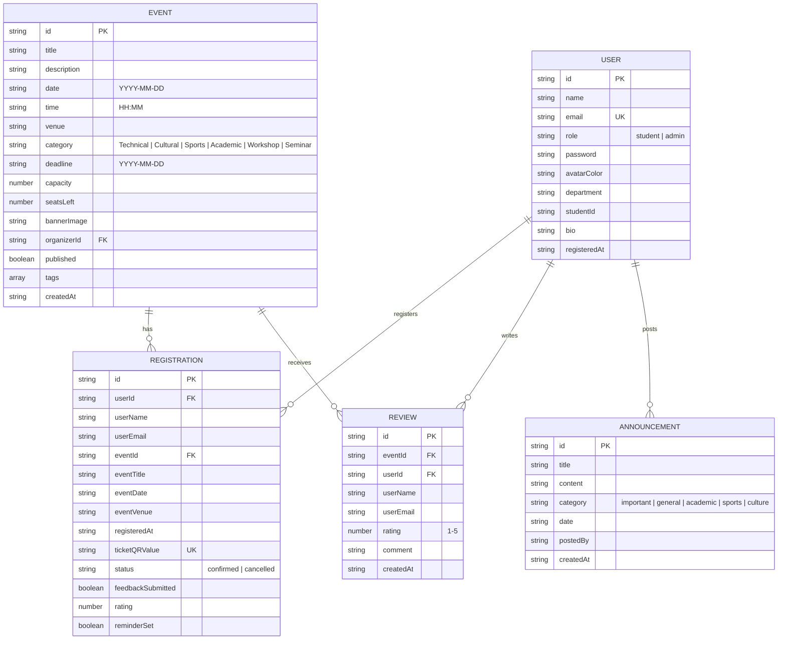

# 🎓 College Event Portal

> A comprehensive, full-featured college event management and registration portal built with **React 19**, **TypeScript**, **Vite**, and **Tailwind CSS v4**. Features student & admin dashboards, event discovery, real-time seat tracking, ticket generation, campus maps, visual analytics, and 5 immersive themes.

<!-- 🔗 Live URL: https://your-deployed-url.com -->

---

## 📸 Features at a Glance

- **🔐 Authentication** — Student login/signup & Admin login with session persistence
- **📅 Event Discovery** — Search, filter by category & availability, paginated browsing
- **🎟️ Registration & Ticketing** — One-click booking with seat tracking, QR ticket passes, Google Calendar integration
- **❤️ Favorites** — Save events for quick access with per-user persistence
- **🤖 Smart Recommendations** — AI-powered suggestions based on department, past events, and tags
- **📆 Interactive Calendar** — Monthly view with color-coded event dots and day agenda
- **📢 Notice Board** — Searchable campus announcements with category filtering
- **📊 Analytics Dashboard** — Real-time stats: category distribution, trending events, weekly activity
- **👤 Student Profile** — Editable profile with ticket management, share, and calendar export
- **🛡️ Admin Cockpit** — Full CRUD for events & announcements, attendee register tables, event tagging system
- **⭐ Reviews & Ratings** — Star ratings and feedback from registered attendees
- **🗺️ Campus Map** — Interactive SVG map with venue resolver and building details
- **🎨 5 Themes** — Light, Dark, Midnight Neon, Green Campus, Warm Editorial
- **🔔 Push Notifications** — Simulated event reminders with SMS/Email toggle
- **📤 Export Tools** — ICS calendar files, PNG flyer generation, deep link sharing

---

## 🚀 Quick Start — Run Locally

### Prerequisites

- **Node.js** v18+ ([download](https://nodejs.org/))
- **npm** (comes with Node.js)

### Setup Instructions

```bash
# 1. Clone the repository
git clone https://github.com/<your-username>/college-event-portal.git
cd college-event-portal

# 2. Install dependencies
npm install

# 3. Start development server
npm run dev
```

The app will be running at **http://localhost:3000/**

### Demo Credentials (Quick Access)

| Role | Email | Password |
|------|-------|----------|
| **Student** | `student@college.edu` | `student123` |
| **Admin** | `admin@college.edu` | `admin123` |

> 💡 You can also click the **"Student Profile"** or **"Admin Profile"** quick-fill buttons on the login screen to auto-fill credentials.

---

## 🏗️ Architecture & Tech Stack

### Technology Stack

| Layer | Technology | Purpose |
|-------|-----------|---------|
| **Frontend Framework** | React 19 + TypeScript | Component-based UI with type safety |
| **Build Tool** | Vite 6 | Lightning-fast HMR and bundling |
| **Styling** | Tailwind CSS v4 | Utility-first CSS with custom theme system |
| **Animations** | Motion (Framer Motion) | Page transitions, toast animations, micro-interactions |
| **Icons** | Lucide React | Consistent, lightweight SVG icon library |
| **Database** | localStorage (Browser) | Client-side persistence (no backend required) |

### Project Structure

```
college-event-portal/
├── index.html              # HTML entry point
├── vite.config.ts          # Vite build configuration
├── tsconfig.json           # TypeScript compiler options
├── package.json            # Dependencies and scripts
├── .env.example            # Environment variable template
│
└── src/
    ├── main.tsx            # React root mounting
    ├── App.tsx             # Main application component (routing, state, layout)
    ├── index.css           # Global styles, theme overrides, scrollbar customization
    ├── types.ts            # TypeScript interfaces & type definitions
    │
    ├── components/
    │   ├── AuthModal.tsx         # Login/Signup authentication modal
    │   ├── EventCard.tsx         # Event card with registration, reviews, map, sharing
    │   ├── CalendarView.tsx      # Interactive monthly calendar with agenda panel
    │   ├── AnalyticsDashboard.tsx # Statistics, charts, and trending events
    │   ├── AnnouncementsList.tsx  # Searchable campus notice board
    │   ├── UserProfile.tsx       # Student profile with ticket management
    │   ├── AdminPanel.tsx        # Admin CRUD for events, announcements, registrations
    │   └── EventBackground.tsx   # Animated floating icons background
    │
    ├── data/
    │   └── defaultData.ts       # Seed data (3 users, 11 events, 3 announcements)
    │
    └── utils/
        └── db.ts                # localStorage CRUD operations & business logic
```

### Architecture Decisions

1. **Client-Side Only (No Backend)**: The entire application runs in the browser using `localStorage` as the database. This eliminates the need for server setup, API keys, or database provisioning while demonstrating full CRUD functionality.

2. **Single-Page Application (SPA)**: Tab-based navigation managed via React state (`activeTab`) instead of a router. This keeps the app lightweight while supporting deep linking via URL query parameters.

3. **Centralized State Management**: All database state is managed in `App.tsx` and passed down via props. The `db.ts` utility provides atomic CRUD operations that read/write to localStorage, ensuring data consistency.

4. **Theme System via CSS Overrides**: Five themes are implemented using CSS class-based overrides (`.theme-neon`, `.theme-forest`, `.theme-sepia`) in `index.css`, layered on top of Tailwind's built-in dark mode. This approach allows deep visual customization without modifying component code.

5. **Recommendation Engine**: A scoring algorithm matches events to students based on (a) previously attended event categories, (b) department affiliation keywords, and (c) shared tags — providing personalized suggestions without ML infrastructure.

---

## 🗄️ Database Schema

The application uses **localStorage** with a single JSON document (`college_event_portal_db`) containing five collections:

### Entity Relationship Diagram



### Schema Details

| Collection | Key Fields | Purpose |
|------------|-----------|---------|
| **users** | `id`, `email` (unique), `role`, `department` | User accounts with role-based access |
| **events** | `id`, `category`, `capacity`/`seatsLeft`, `deadline` | Campus events with real-time seat tracking |
| **registrations** | `userId` + `eventId` (compound), `status`, `ticketQRValue` | Booking records with ticket generation |
| **announcements** | `id`, `category`, `postedBy` | Campus-wide notice board entries |
| **reviews** | `userId` + `eventId` (compound), `rating`, `comment` | Student feedback per event |

### Data Integrity Rules

- **Seat Management**: Registering decrements `seatsLeft`; cancelling increments it (capped at `capacity`)
- **Duplicate Prevention**: Only one confirmed registration per user per event
- **Cascade Deletes**: Deleting an event cancels all associated registrations
- **Capacity Adjustment**: Editing event capacity preserves already-booked seats
- **Auto-Recovery**: Corrupted localStorage data is replaced with seed defaults
- **Backwards Compatibility**: Missing `reviews` array is auto-injected on load

---

## 📜 Available Scripts

| Command | Description |
|---------|-------------|
| `npm install` | Install all dependencies |
| `npm run dev` | Start development server on port 3000 |
| `npm run build` | Create production build in `dist/` |
| `npm run preview` | Preview production build locally |
| `npm run lint` | Run TypeScript type checking |

---

## 🎨 Theme Modes

| Theme | Style | Accent Colors |
|-------|-------|---------------|
| ☀️ **Light** | Default clean white | Blue primary |
| 🌙 **Slate Dark** | Dark slate backgrounds | Blue primary |
| ✨ **Midnight Neon** | Deep purple/black | Electric cyan + neon pink |
| 🍃 **Green Campus** | Organic sage-white | Forest green |
| 📜 **Warm Editorial** | Papyrus cream + serif fonts | Crimson red |

---

## 👥 Seed Data

The app ships with pre-loaded demo data:

- **3 Users**: 1 Admin (Prof. Sarah Jenkins), 2 Students (Alex Rivera, Emily Chen)
- **11 Events**: Hackathons, cultural nights, sports, workshops, seminars, MUN, marathon, and more
- **3 Announcements**: Volunteer call, mid-semester notice, sports kit distribution
- **2 Registrations**: Alex Rivera pre-registered for HackHorizon & Basketball Championship

---

## 📄 License

© 2026 Campus Tech Inc. All rights reserved.
