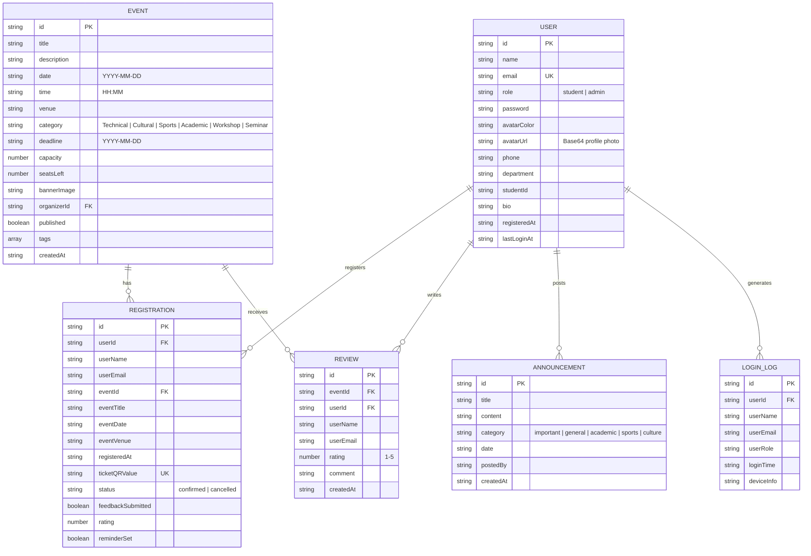

# 🎓 College Event Portal

> A comprehensive, full-featured college event management and registration portal built with **React 19**, **TypeScript**, **Vite**, **Tailwind CSS v4**, and **Supabase Cloud Database**. Features student & admin dashboards, real-time student roster audit, time-based dynamic themes, ticket generation with booking timestamps, campus maps, visual analytics, and cloud sync.

🔗 **Live URL:** [https://college-event-portal-bice.vercel.app/](https://college-event-portal-bice.vercel.app/)

⭐ **If you find this repository useful or helpful, please give it a ⭐ star on GitHub!**

---

## 📸 Features at a Glance

- **🔐 Authentication & Audit** — Student login/signup, Admin login, and real-time login timestamp logging
- **☁️ Cloud Database Sync** — Supabase Cloud DB integration (`@supabase/supabase-js`) with cross-tab broadcast synchronization
- **👨‍🎓 Admin Student Roster** — Full student directory showing email, department, roll number, last login time, and active bookings
- **🚫 Admin Event Revocation** — Admin power to remove/cancel any student's registration directly from the roster (restores seat pool)
- **🔎 Student Profile Inspector** — Detailed modal showing student bio, academic credentials, and complete booking history with exact timestamps
- **⏱️ Booking Timestamps** — Displays exact registration date & time on digital tickets and admin inspectors
- **⏰ Time-of-Day Auto Theme Shift** — Automatic day/night theme transitions (Daytime Light mode / Nighttime Midnight Neon mode)
- **🏛️ Campus Building Vectors** — Modern background aesthetics with SVG building silhouettes (Auditorium, Library, Clock Tower, Sports Arch)
- **📅 Event Discovery** — Search, filter by category & availability, paginated browsing
- **🎟️ Registration & Ticketing** — One-click booking, seat tracking, downloadable PNG QR ticket passes, Google Calendar integration
- **❤️ Favorites** — Save events for quick access with per-user persistence
- **🤖 Smart Recommendations** — AI-powered suggestions based on department, past events, and tags
- **📆 Interactive Calendar** — Monthly view with color-coded event dots and day agenda
- **📢 Notice Board** — Searchable campus announcements with category filtering
- **📊 Analytics Dashboard** — Real-time stats: category distribution, trending events, weekly activity
- **⭐ Reviews & Ratings** — Star ratings and feedback from registered attendees
- **🗺️ Campus Map** — Interactive SVG map with venue resolver and building details
- **🎨 5 Themes** — Light, Dark, Midnight Neon, Green Campus, Warm Editorial + Auto Time-of-Day
- **🔔 Push Notifications** — Simulated event reminders with SMS/Email toggle
- **📤 Export Tools** — ICS calendar files, PNG flyer generation, deep link sharing
- **📱 Responsive Mobile Navigation** — Mobile-optimized navigation bar with an interactive hamburger dropdown menu ensuring clean UI on all devices

---

## 🚀 Quick Start — Run Locally

### Prerequisites

- **Node.js** v18+ ([download](https://nodejs.org/))
- **npm** (comes with Node.js)

### Setup Instructions

```bash
# 1. Clone the repository
git clone https://github.com/Pranay-Sai-Nadh-2006/college-event-portal.git
cd college-event-portal

# 2. Install dependencies
npm install

# 3. Start development server
npm run dev
```

The app will be running at **http://localhost:3000/**

### Environment Variables (Optional for Cloud DB)

Create a `.env` file based on `.env.example`:

```env
VITE_SUPABASE_URL="https://your-supabase-project.supabase.co"
VITE_SUPABASE_ANON_KEY="your-supabase-anon-key"
```

### Demo Credentials (Quick Access)

| Role | Email | Password |
|------|-------|----------|
| **Student** | `student@college.edu` | `student123` |
| **Admin** | `admin@college.edu` | `admin123` |

> 💡 You can also click the **"Student Profile"** or **"Admin Profile"** quick-fill buttons on the login screen to auto-fill credentials.

---

## 🏗️ Architecture & Tech Stack

### Technology Stack

| Layer | Technology | Purpose |
|-------|-----------|---------|
| **Frontend Framework** | React 19 + TypeScript | Component-based UI with type safety |
| **Build Tool** | Vite 6 | Lightning-fast HMR and bundling |
| **Styling & Responsiveness** | Tailwind CSS v4 + Bootstrap 5 | Utility-first CSS + Bootstrap 5 responsive grid system |
| **Cloud Database** | Supabase (`@supabase/supabase-js`) | Cloud persistence & cross-device state sync |
| **Local Database** | localStorage (Browser) | Instant fallback & offline support |
| **Animations** | Motion (Framer Motion) | Page transitions, toast animations, micro-interactions |
| **Icons** | Lucide React | Consistent, lightweight SVG icon library |

### Project Structure

```
college-event-portal/
├── index.html              # HTML entry point with security meta headers
├── vite.config.ts          # Vite build configuration
├── tsconfig.json           # TypeScript compiler options
├── package.json            # Dependencies and scripts
├── .env.example            # Environment variable template with Supabase config
│
└── src/
    ├── main.tsx            # React root mounting
    ├── App.tsx             # Main application component (routing, real-time sync, layout)
    ├── index.css           # Global styles, theme overrides, scrollbar customization
    ├── types.ts            # TypeScript interfaces & type definitions (LoginLog, User, Event, etc.)
    │
    ├── components/
    │   ├── AuthModal.tsx         # Login/Signup authentication modal with login logging
    │   ├── EventCard.tsx         # Event card with registration, reviews, map, sharing
    │   ├── CalendarView.tsx      # Interactive monthly calendar with agenda panel
    │   ├── AnalyticsDashboard.tsx # Statistics, charts, and trending events
    │   ├── AnnouncementsList.tsx  # Searchable campus notice board
    │   ├── UserProfile.tsx       # Student profile with ticket management & booking timestamps
    │   ├── AdminPanel.tsx        # Admin CRUD, Student Roster, Login Audit, and Revoke tools
    │   └── EventBackground.tsx   # Campus building vector silhouettes & geometric background
    │
    ├── data/
    │   └── defaultData.ts       # Seed data (users, events, announcements, registrations)
    │
    └── utils/
        ├── db.ts                # Database CRUD operations, login logging, admin revoke logic
        └── supabase.ts          # Supabase cloud database integration client
```

### Architecture Decisions

1. **Cloud Sync with Local Fallback**: Uses Supabase Cloud Database (`@supabase/supabase-js`) combined with `localStorage` and `BroadcastChannel`. This allows multi-device synchronization while ensuring zero setup friction and full offline fallback.

2. **Real-Time Admin Roster**: Student signups and logins immediately trigger state reloads, allowing administrators to view newly registered students, active login timestamps, and event bookings in real-time.

3. **Admin Revocation Power**: Admins can remove/revoke any student's event registration directly from the Student Roster table, automatically returning the seat to the event's available capacity.

4. **Time-of-Day Theme Engine**: Includes an optional Auto Time-of-Day theme switcher that automatically transitions between daytime light themes and nighttime Midnight Neon dark mode based on local time.

---

## 🗄️ Database Schema

### Entity Relationship Diagram



### Schema Details

| Collection | Key Fields | Purpose |
|------------|-----------|---------|
| **users** | `id`, `email`, `role`, `avatarUrl`, `phone`, `lastLoginAt` | User accounts with profile photo, phone, role-based access & login timestamps |
| **events** | `id`, `category`, `capacity`/`seatsLeft`, `deadline` | Campus events with real-time seat tracking |
| **registrations** | `userId`, `eventId`, `registeredAt`, `status`, `ticketQRValue` | Booking records with registration timestamps & ticket QR |
| **announcements** | `id`, `category`, `postedBy` | Campus-wide notice board entries |
| **reviews** | `userId` + `eventId`, `rating`, `comment` | Student feedback per event |
| **login_logs** | `userId`, `userEmail`, `loginTime`, `deviceInfo` | Real-time audit history of user logins |

---

## 🎨 Theme Modes

| Theme | Style | Accent Colors |
|-------|-------|---------------|
| ☀️ **Light** | Default clean white | Blue primary |
| 🌙 **Slate Dark** | Dark slate backgrounds | Blue primary |
| ✨ **Midnight Neon** | Deep purple/black | Electric cyan + neon pink |
| 🍃 **Green Campus** | Organic sage-white | Forest green |
| 📜 **Warm Editorial** | Papyrus cream + serif fonts | Crimson red |
| ⏰ **Auto Time-of-Day** | Time-based automatic shift | Daytime / Nighttime mode |

---

## 📜 Available Scripts

| Command | Description |
|---------|-------------|
| `npm install` | Install all dependencies |
| `npm run dev` | Start development server on port 3000 |
| `npm run build` | Create production build in `dist/` |
| `npm run preview` | Preview production build locally |
| `npm run lint` | Run TypeScript type checking |

---

⭐ **Enjoyed this project? If you found this repository useful, please consider giving it a Star on GitHub!**

## 📄 License

© 2026 Campus Tech Inc. All rights reserved.
